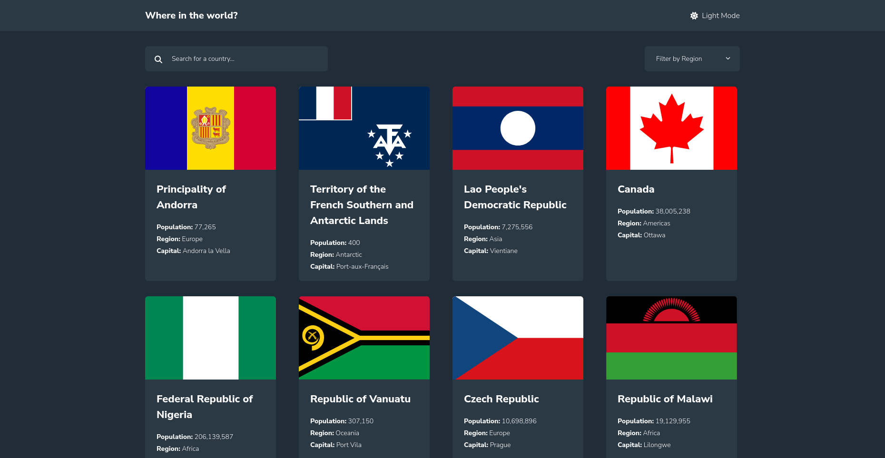
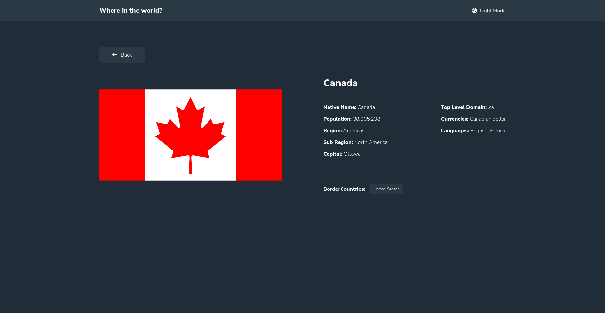

# Frontend Mentor - REST Countries API with color theme switcher solution

This is a solution to the [REST Countries API with color theme switcher challenge on Frontend Mentor](https://www.frontendmentor.io/challenges/rest-countries-api-with-color-theme-switcher-5cacc469fec04111f7b848ca). Frontend Mentor challenges help you improve your coding skills by building realistic projects.

## Table of contents

- [Overview](#overview)
  - [The challenge](#the-challenge)
  - [Screenshot](#screenshot)
  - [Links](#links)
- [My process](#my-process)
  - [Built with](#built-with)
- [Author](#author)

**Note: Delete this note and update the table of contents based on what sections you keep.**

## Overview

### The challenge

Users should be able to:

- See all countries from the API on the homepage
- Search for a country using an `input` field
- Filter countries by region
- Click on a country to see more detailed information on a separate page
- Click through to the border countries on the detail page
- Toggle the color scheme between light and dark mode _(optional)_

### Screenshot

### Links

- Solution URL: [Github Repo](https://github.com/kbrownw/countriesWebsite)
- Live Site URL: [Live Solution](https://where-in-the-world-by-ke-1d073.web.app/)

## My process

### Built with

- Semantic HTML5 markup
- CSS custom properties
- Flexbox
- Mobile-first workflow
- [React](https://reactjs.org/) - JS framework
- [Vite](https://vitejs.dev/) - Devolopement Environment
- [Typescript](https://www.typescriptlang.org/) - Javascript with syntax for types.
- [TailwindCSS](https://tailwindcss.com/) - For styles
- [FramerMotion](https://www.framer.com/motion/) - For animations

## Author

- LinkedIn - [Keith Brown](https://www.linkedin.com/in/keith-brown-b9a3a32a2/)
- Frontend Mentor - [@kbrownw](https://www.frontendmentor.io/profile/kbrownw)
- Github - [https://github.com/kbrownw](https://github.com/kbrownw)
